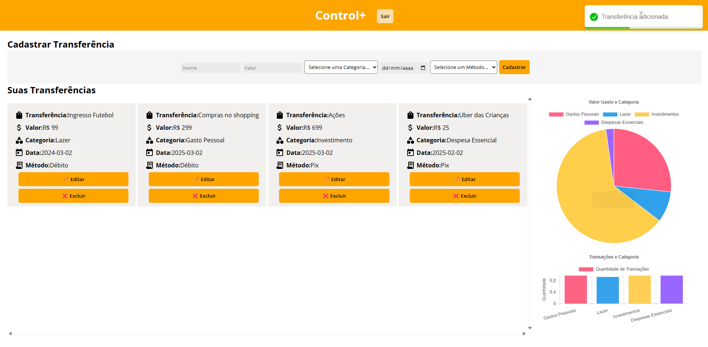
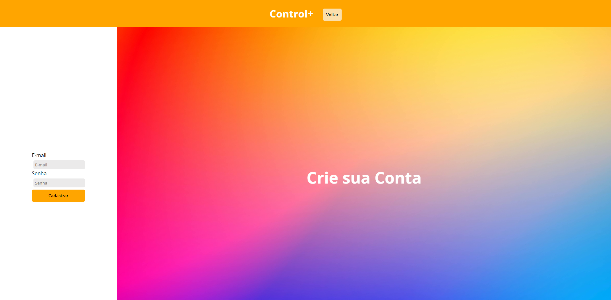

cd
# Control+

Aplicação Full Stack para controle de financeiro desenvolvido com ReactJS, NodeJS e banco de dados MySQL.


## Funcionalidades

- CRUD de Transferências Monetárias;
- Autenticação (Login/Registro);
- Dashboard interativo com gráficos para entender o funcionamento das financas.


## Stack utilizada

**Front-end:** React, ChartJS

**Back-end:** Node, Express

**Banco de Dados:** MySQL


## Instalação

Clone o repositório, acesse a pasta gerenciadorDeGastos\client\gerenciadordegastos e instale as dependências do package.json

```bash
  npm install 
```

Em seguida execute:

```bash
  npm run dev 
```

Para o servidor, acesse a pasta gerenciadorDeGastos\server e execute o seguinte comando:

```bash
  npm install 
```
Em seguida execute o servidor:

```bash
  node app.js
```


## Screenshots




